# 이중표 · Eddy

**사용자가 한 순간에 몰려도 실시간 UX와 성능을 지키고, 없는 도구는 직접 만들어 배포하는 프론트엔드 엔지니어**

MAU 90만 스니커즈 발매 플랫폼과 커머스를 프론트엔드 1~3인으로 3년간 설계·운영했습니다.
문제를 만나면 끝까지 파고, 실측으로 검증하고, 글로 남기고, 도구로 만듭니다.

[기술 블로그 (21편)](https://www.eddy-dev.xyz/blog) · leejpsd@gmail.com

`React` `Next.js` `TypeScript` `React Query` `Zustand` `Vitest` `MSW` `Sentry` `AWS(ECS/EC2)` `Redis`

|  73 → 99  |  13 → 6대  |  105%↑  |  90%↓  |
| :---: | :---: | :---: | :---: |
| **Lighthouse** · 마이그레이션 | **렌더링 서버** · 비용 54%↓ | **검색 클릭** · SEO TF 3주 | **Sentry 노이즈** · 2주 |

<b>🗺️ 발매 순간, 동시접속 3만의 요청이 지나가는 길 — 클릭해서 열기</b>

 

이미지·정적은 CloudFront가 엣지에서 끝내고, HTML·데이터는 ALB 뒤 6대가 Redis 한 곳을 봅니다.
웹훅이 로드밸런서 탓에 한 대에만 도달해도 공유 CacheHandler 덕에 전 인스턴스가 같은 무효화를 봅니다 — 같은 구조를 재현한 [실측 랩](https://github.com/leejpsd/next-redis-cache)에서 무효화 전파 평균 6.4ms를 검증했고, [npm 패키지](https://www.npmjs.com/package/@leejpsd/nextjs-cache-handler)로 일반화했습니다.

---

## 만들어서 배포한 것들

| 프로젝트 | 무엇을 해결하나 |
|---|---|
| [**@leejpsd/nextjs-cache-handler**](https://www.npmjs.com/package/@leejpsd/nextjs-cache-handler) | 멀티 인스턴스 Next.js의 캐시·무효화를 Redis로 공유. Next 16의 두 캐시 인터페이스(`cacheHandler`/`cacheHandlers`) 모두 지원 — 선도 OSS가 "Help needed"로 둔 공백을 메움. Lua 원자화·장애 폴백·배포 격리, 실 Redis 7 통합 테스트 21 시나리오 |
| [**next-redis-cache**](https://github.com/leejpsd/next-redis-cache) | 위 패키지의 실측 랩 — AWS ECS 2 task + ElastiCache에서 무효화 전파 평균 6.4ms, 스파이크 20,377 요청에 origin 호출 1회, 6개 렌더링 전략 비교 실측. [라이브 대시보드](http://next-redis-cache-staging-alb-1315597713.ap-southeast-2.elb.amazonaws.com/dashboard) |
| [**typescript-react-nextjs-patterns**](https://github.com/leejpsd/typescript-react-nextjs-patterns) | AI 코딩 에이전트용 Agent Skill — 17모듈·4,000줄. 규칙을 HARD RULE/DEFAULT/SITUATIONAL로 티어링하고, 컴팩션 후 규칙 유실을 복구하는 구조까지 설계 |
| [**shopby-mcp**](https://www.npmjs.com/package/shopby-mcp) | 검색이 없는 Shopby(NHN Commerce) API 문서를 자연어로 검색하는 MCP 서버. OpenAPI 인덱싱 + 한↔영 동의어, `npx`만으로 zero-config |
| [**my-design-system**](https://github.com/leejpsd/my-design-system) | 접근성·테스트·문서화를 갖춘 디자인 시스템 스터디 — 토큰 3계층, WAI-ARIA, Storybook Interaction Test ([Storybook](https://leejpsd.github.io/my-design-system)) |

## 실무에서 한 것들

**Shoeprize** — 한정판 발매정보 플랫폼 (MAU 90만 · Frontend Lead)
- Django → Next.js 14 마이그레이션 주도, 데이터 특성별 렌더링 전략(ISR/CSR/SSG)과 `revalidateTag` 캐시 무효화 설계
- Lighthouse 성능 점수 73→99 (LCP 8.6s→0.9s) · 렌더링/웹 서버 13→6대 (비용 54%↓)
- SEO TF 리딩 — 3주에 검색 클릭 105%↑ (Search Console 검증)
- 커뮤니티 웹/네이티브 경계 설계 — 읽기는 웹, 쓰기는 네이티브, refetch 없는 4단계 병합

**Kasina** — 프리미엄 스니커즈 커머스 (Frontend Engineer, 전담)
- Shopby + 사내 API 이원화 인증 설계 — race condition 중앙 제어, 만료 10분 전 선제 갱신, WebView 앱-웹 동기화
- 일 400건 로그인 풀림을 Sentry 커스텀 계측으로 추적, 서버 측 원인을 데이터로 증명해 종결
- 운영 중 커머스에 테스트 127개 도입 (Vitest + MSW, 돈 흐름부터 ROI 순서로)

**AI 실무 적용** — 노이즈로 알림을 꺼둔 프로덕션 Sentry를 Claude Code + MCP로 2주 만에 고유 이슈 90% 정리(1,463→150, 이벤트 100% 보존), 주간 트리아지 루틴 자동화

---

*재현이 안 되는 문제는 데이터를 먼저 만들고, 들은 결론은 직접 측정해 확인합니다.*
